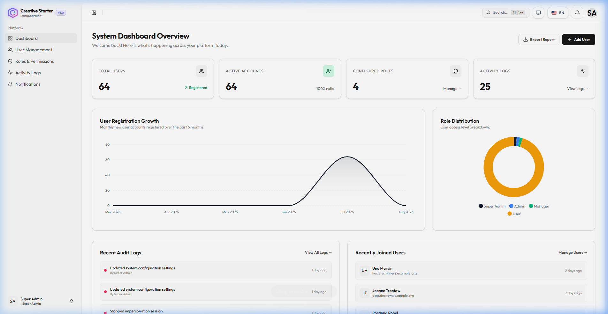
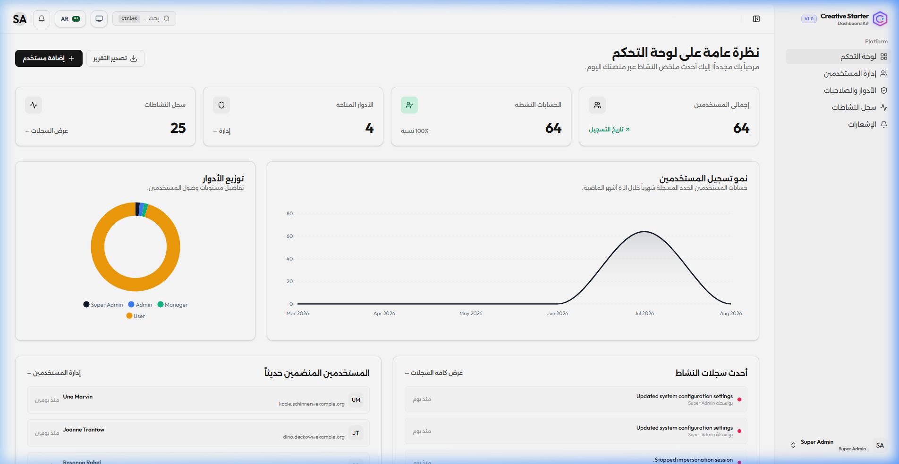
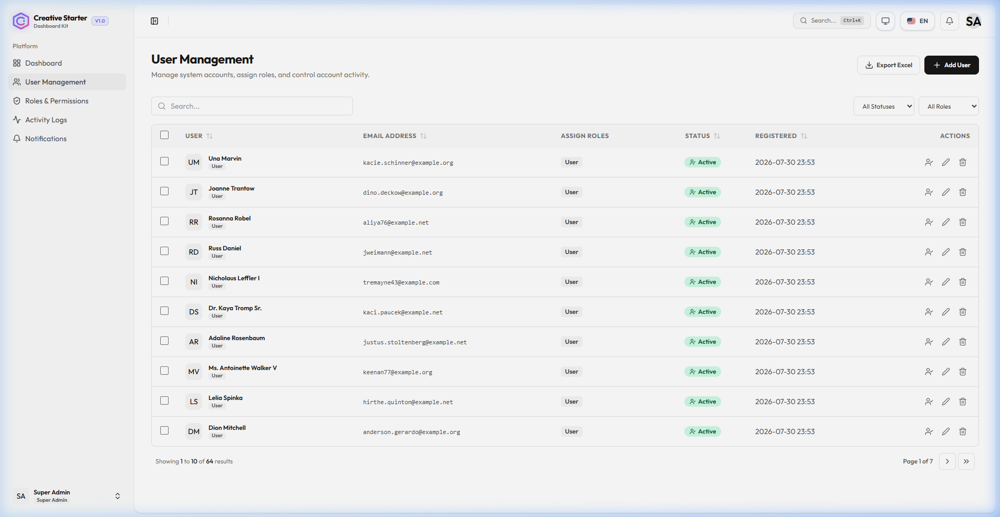
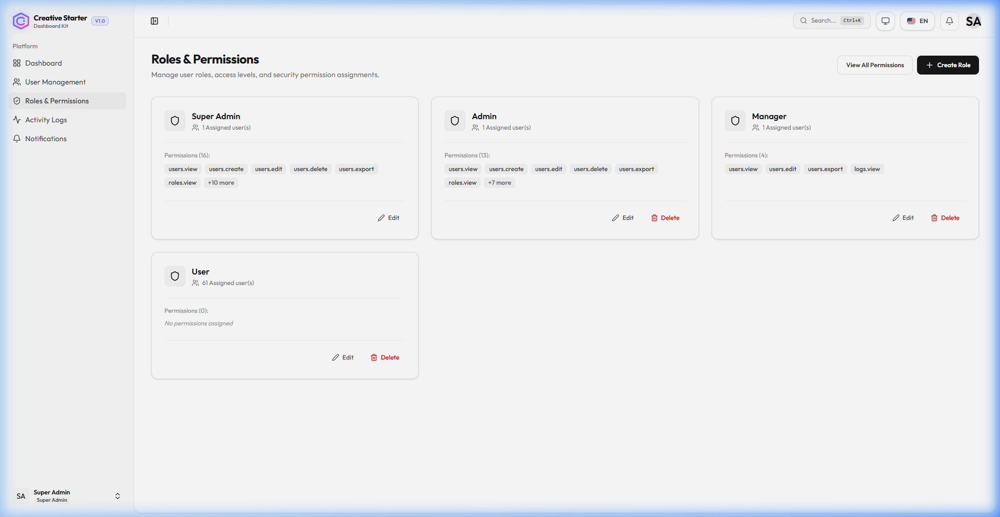
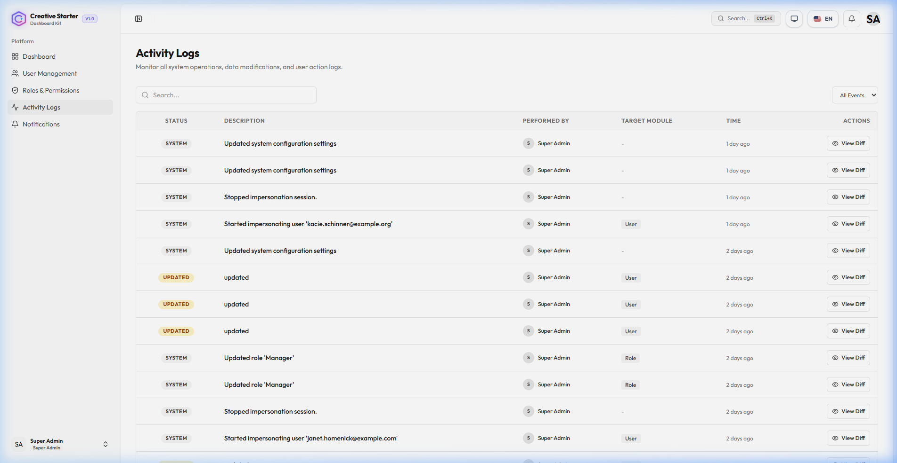

<div align="center">
  

  # 🚀 Creative Starter Dashboard Kit
  ### State-of-the-Art Enterprise SaaS Foundation & Dashboard Starter Kit
  *Crafted with Laravel 13, Vue 3 (Composition API), Inertia v3, Tailwind CSS v4, TypeScript & Spatie RBAC*

  <br />

  [](https://laravel.com)
  [](https://vuejs.org)
  [](https://inertiajs.com)
  [](https://tailwindcss.com)
  [](https://www.typescriptlang.org)
  [](tests/)
  [](LICENSE.md)

</div>

---

## 🖼️ Visual Showcase & Previews

### 💻 Enterprise LTR Dashboard Overview


### 🌐 Native Bi-Directional Arabic (RTL) Dashboard


### 👥 User Management & Role Assignment


### 👑 Spatie Roles & Granular Permissions Matrix


### 📜 Real-Time Audit Trails & Activity Logs


---

## 🌟 Overview

The **Creative Starter Dashboard Kit** is an opinionated, production-ready SaaS starter kit designed for rapid development of enterprise web applications. It brings together **Laravel 13**, **Vue 3**, **Inertia v3**, and **Tailwind CSS v4** with full bi-directional **English & Arabic (RTL)** internationalization, advanced **Role-Based Access Control (RBAC)**, real-time activity auditing with **1-click undo**, user impersonation, Sanctum API access tokens, and a complete suite of pre-built UI components.

> **Created by:** Eng. Hasan Mohammad Hasan (م. حسن محمد حسن)

---

## ⚡ Supercharge Your Starter Kit with Creative Vue CRUD Studio PRO!

Want to generate full-stack Eloquent Models, Migrations, Controllers, Form Requests, and Vue 3 Inertia pages visually in 30 seconds?

Check out **[Creative Vue CRUD Studio PRO](https://github.com/mr-creative-hmh/creative-vue-crud-studio-)**!

- 🎛️ **4-Tab Visual Studio Dashboard**: Zero-clutter visual builder with 11 domain presets (Products, Orders, Patients, Courses, Tickets, CRM, etc.).
- 📜 **Schema Revision History & 1-Click Rollback**: Restore past schema versions safely with 1 click.
- 📱 **Context-Aware Smart UI Input Controls**: Auto-maps DB column types to WYSIWYG, Color Pickers, iOS Toggles, Currency Inputs, Date Pickers, and Photo Uploads.
- 📊 **ApexCharts Analytics & Soft Deletes**: Built-in chart generator and full trash/restore support.

👉 **[Explore Creative Vue CRUD Studio PRO](https://github.com/mr-creative-hmh/creative-vue-crud-studio-)**

---

## ✨ Feature Highlights

| Module | Feature Capabilities |
| :--- | :--- |
| 🛡️ **Authentication & Security** | Laravel Fortify backend, Passkeys (WebAuthn), Two-Factor Authentication (2FA) with QR & recovery codes, session management, and rate limiting. |
| 👤 **User Impersonation** | 1-Click "Log in as User" capability for Super Admins with sticky status banner and full audit log tracking. |
| 👑 **RBAC & Authorization** | Spatie Roles & Permissions with granular permission matrices, custom module generators, and reactive `useAuth()` composable. |
| 📜 **Audit Trails & 1-Click Undo** | Complete activity logging with JSON diff visualizer and 1-click state reversal for created/updated models. |
| ⚙️ **System Settings Management** | Control application name, support email, default language, and web-wide **Maintenance Mode** directly from the UI. |
| 🔑 **API Tokens Manager** | Issue, manage, and revoke Laravel Sanctum personal access tokens with custom permissions. |
| 📊 **Analytics & Charts** | KPI cards and interactive ApexCharts for user signup trends and access role distribution. |
| 🔔 **Notification Center** | Real-time unread counter, slide-out notification drawer, and full management page. |
| ⚡ **Data Tables & Bulk Operations** | Multi-select checkboxes, batch actions (bulk delete, status toggling), server-side pagination, sorting, and search filters. |
| 🌐 **i18n & Bi-directional RTL** | Instant switching between **English (LTR)** and **Arabic (RTL)** with layout direction synchronization. |
| 🎨 **Theme & Accent Customization** | Light/Dark theme switching with customizable primary color swatch accents (Indigo, Emerald, Violet, Rose, Amber, Slate). |
| 🔔 **Adaptive Toast Alerts** | Automatic Sonner toast notifications for all system actions, status changes, and form validation errors (bottom-right in LTR, bottom-left in RTL). |

---

## 🛠️ Technology Stack & Dependencies

### Backend
- **Framework**: [Laravel 13](https://laravel.com) (PHP 8.3+)
- **Authentication**: [Laravel Fortify](https://laravel.com/docs/fortify) & [Laravel Sanctum](https://laravel.com/docs/sanctum)
- **Permissions**: [Spatie Laravel-Permission](https://spatie.be/docs/laravel-permission)
- **Audit Logs**: [Spatie Laravel-Activitylog](https://spatie.be/docs/laravel-activitylog)
- **Type Generation**: [Laravel Wayfinder](https://github.com/laravel/wayfinder)
- **Testing**: [Pest PHP 4](https://pestphp.com)

### Frontend
- **Framework**: [Vue 3](https://vuejs.org) (Composition API, `<script setup>`)
- **SPA Bridge**: [Inertia.js v3](https://inertiajs.com)
- **Styling**: [Tailwind CSS v4](https://tailwindcss.com) & [Radix Vue / shadcn-vue](https://www.radix-vue.com)
- **Language**: [TypeScript 5](https://www.typescriptlang.org)
- **Charts**: [ApexCharts](https://apexcharts.com)
- **Toasts**: [vue-sonner](https://vue-sonner.verna.joly.dev)

---

## 🚀 Quick Start Guide

### Prerequisites
- **PHP** >= 8.3
- **Composer** >= 2.x
- **Node.js** >= 20.x & **NPM**

### Step-by-Step Installation

```bash
# 1. Clone the repository
git clone https://github.com/mr-creative-hmh/laravel-vue-creative-starter-dashboard-kit.git
cd laravel-vue-creative-starter-dashboard-kit

# 2. Install PHP dependencies
composer install

# 3. Install JavaScript dependencies
npm install

# 4. Environment setup & application key generation
cp .env.example .env
php artisan key:generate

# 5. Create storage symlink for user avatar uploads
php artisan storage:link

# 6. Run database migrations & seed initial records
php artisan migrate:fresh --seed

# 7. Launch development servers (Laravel Artisan + Vite)
composer run dev
```

The application will be accessible at `http://127.0.0.1:8000`.

---

## 🔑 Pre-Configured Test Accounts

After database seeding (`php artisan migrate:fresh --seed`), test accounts with varying permission levels are available:

| Role | Email | Password | Access Level |
| :--- | :--- | :--- | :--- |
| **Super Admin** | `admin@example.com` | `password` | Full Unrestricted Access |
| **Admin** | `manager.admin@example.com` | `password` | System & User Management |
| **Manager** | `manager@example.com` | `password` | User View/Edit & Audit Logs |
| **User** | `user@example.com` | `password` | Standard Dashboard End-User |

---

## 🤖 Permission Generator Commands

The starter kit includes automated permission generators for new modules:

### 1. Artisan Command Line Generator
```bash
# Generate permissions for a specific module (e.g. Products)
php artisan permissions:generate Product

# Automatically scan app/Models/ and generate missing CRUD permissions
php artisan permissions:sync
```

### 2. Web UI Permission Generator
Navigate to `/permissions` in the dashboard and click **"Generate Module Permissions"** to create a full CRUD permission set (`view`, `create`, `edit`, `delete`, `export`) via an interactive UI.

---

## 🧪 Testing & Code Quality Assurance

This repository follows strict code quality standards:

```bash
# Run the Pest PHP test suite (73 passing tests)
php artisan test --compact

# Check PHP Code Style formatting (Laravel Pint)
vendor/bin/pint --test

# Fix PHP Code Style formatting automatically
vendor/bin/pint

# Run Vue/TypeScript type checking
npm run types:check

# Compile production frontend assets
npm run build
```

---

## 📁 Repository Structure

```
laravel-vue-creative-starter-dashboard-kit/
├── app/
│   ├── Console/Commands/       # Custom Artisan commands (Permission generators)
│   ├── Http/
│   │   ├── Controllers/        # Controllers (User, Role, Permission, Log, Settings)
│   │   ├── Middleware/         # Maintenance mode, Locale & Inertia middleware
│   │   └── Responses/          # Custom Fortify response contracts
│   ├── Models/                 # Eloquent Models (User, Role, ActivityLog, SystemSetting)
│   └── Providers/              # App & Fortify service providers
├── database/
│   ├── migrations/             # Database schema migrations
│   └── seeders/                # RBAC & test user seeders
├── resources/
│   ├── js/
│   │   ├── components/         # Modular Vue components (auth, user, logs, notifications, ui)
│   │   ├── composables/        # Composables (useAuth, useTrans, useAppearance)
│   │   ├── layouts/            # Layout wrappers (AppLayout, AuthLayout, SettingsLayout)
│   │   ├── pages/              # Inertia Vue page views (Dashboard, Users, Settings, Errors)
│   │   └── lib/                # Flash toast handlers & utilities
│   └── views/                  # Root Inertia app.blade.php template
├── routes/
│   ├── web.php                 # Core dashboard routes
│   └── settings.php            # Settings & profile routes
└── tests/                      # Pest feature & unit tests
```

---

## 👨‍💻 Author & Maintainer

Designed and developed by **Eng. Hasan Mohammad Hasan** (م. حسن محمد حسن).

---

## 💖 Sponsorship & Support

If you find this starter kit helpful and want to support its ongoing open-source development:

- 🌟 **Star this repository** on GitHub to help others discover it!
- 💖 **Sponsor on GitHub**: [GitHub Sponsors](https://github.com/sponsors/mr-creative-hmh)
- 🚀 **Upgrade to PRO**: [Creative Vue CRUD Studio PRO](https://github.com/mr-creative-hmh/creative-vue-crud-studio-)

---

## 📄 License

This project is open-sourced software licensed under the [MIT license](LICENSE.md).

---

## 🌍 القسم العربي (Arabic Section)

<div align="center">
  

  # 🚀 حزمة لوحة التحكم الإبداعية للمبتدئين
  ### أساس تطبيقات SaaS للمؤسسات المتطور وحزمة لوحة تحكم للمبتدئين
  *صُممت باستخدام Laravel 13، Vue 3 (Composition API)، Inertia v3، Tailwind CSS v4، TypeScript و Spatie RBAC*

  <br />

  [](https://laravel.com)
  [](https://vuejs.org)
  [](https://inertiajs.com)
  [](https://tailwindcss.com)
  [](https://www.typescriptlang.org)
  [](tests/)
  [](LICENSE.md)

</div>

---

## 🌟 نظرة عامة

**حزمة لوحة التحكم الإبداعية للمبتدئين** هي حزمة بداية جاهزة للإنتاج، مصممة للتطوير السريع لتطبيقات الويب للمؤسسات. تجمع معًا **Laravel 13**، **Vue 3**، **Inertia v3**، و **Tailwind CSS v4** مع دعم كامل ثنائي الاتجاه للإنجليزية والعربية (RTL)، نظام متقدم للتحكم في الوصول القائم على الأدوار (RBAC)، تدقيق النشاط في الوقت الفعلي مع **التراجع بنقرة واحدة**، انتحال المستخدم، رموز الوصول إلى API من Sanctum، ومجموعة كاملة من مكونات واجهة المستخدم المبنية مسبقًا.

> **تم الإنشاء بواسطة:** م. حسن محمد حسن

---

## ✨ المميزات الرئيسية

| الوحدة | القدرات والميزات |
| :--- | :--- |
| 🛡️ **المصادقة والأمان** | خلفية Laravel Fortify، مفاتيح المرور (WebAuthn)، المصادقة الثنائية (2FA) مع رموز QR ورموز الاسترداد، إدارة الجلسات، وتقييد المعدل. |
| 👤 **انتحال المستخدم** | إمكانية "تسجيل الدخول كمستخدم" بنقرة واحدة لمشرفي السوبر مع شريط حالة ثابت وتتبع كامل لسجل التدقيق. |
| 👑 **RBAC والتفويض** | أدوار Spatie والصلاحيات مع مصفوفات صلاحيات دقيقة، مولدات وحدات مخصصة، ومجموعة `useAuth()` التفاعلية. |
| 📜 **سجلات التدقيق والتراجع بنقرة واحدة** | تسجيل نشاط كامل مع محاكي فرق JSON والتراجع عن الحالة بنقرة واحدة للنماذج المنشأة/المحدثة. |
| ⚙️ **إدارة إعدادات النظام** | التحكم في اسم التطبيق، البريد الإلكتروني للدعم، اللغة الافتراضية، و **وضع الصيانة** على مستوى الويب مباشرة من واجهة المستخدم. |
| 🔑 **مدير رموز API** | إصدار وإدارة وإلغاء رموز الوصول الشخصية من Laravel Sanctum مع صلاحيات مخصصة. |
| 📊 **التحليلات والرسوم البيانية** | بطاقات KPI ورسوم بيانية تفاعلية من ApexCharts لاتجاهات تسجيل المستخدمين وتوزيع أدوار الوصول. |
| 🔔 **مركز الإشعارات** | عداد للرسائل غير المقروءة في الوقت الفعلي، درج إشعارات منزلقة، وصفحة إدارة كاملة. |
| ⚡ **جداول البيانات والعمليات المجمعة** | مربعات اختيار متعددة، إجراءات دفعية (حذف جماعي، تبديل الحالة)، ترحيم من جانب الخادم، فرز، ومرشحات بحث. |
| 🌐 **i18n و RTL ثنائي الاتجاه** | التبديل الفوري بين **الإنجليزية (LTR)** و **العربية (RTL)** مع مزامنة اتجاه التخطيط. |
| 🎨 **تخصيص السمة واللون** | التبديل بين السمات الفاتحة/الداكنة مع تخصيص ألوان الأساسية (نيلي، زمرد، بنفسجي، وردي، كهرماني، رمادي). |
| 🔔 **تنبيهات التوافق التكيفية** | إشعارات Sonner التلقائية لجميع إجراءات النظام، تغييرات الحالة، وأخطاء التحقق من النموذج (أسفل اليمين في LTR، أسفل اليسار في RTL). |

---

## 🛠️ مجموعة التقنيات والتبعيات

### الخلفية
- **الإطار**: [Laravel 13](https://laravel.com) (PHP 8.3+)
- **المصادقة**: [Laravel Fortify](https://laravel.com/docs/fortify) و [Laravel Sanctum](https://laravel.com/docs/sanctum)
- **الصلاحيات**: [Spatie Laravel-Permission](https://spatie.be/docs/laravel-permission)
- **سجلات التدقيق**: [Spatie Laravel-Activitylog](https://spatie.be/docs/laravel-activitylog)
- **توليد الأنواع**: [Laravel Wayfinder](https://github.com/laravel/wayfinder)
- **الاختبار**: [Pest PHP 4](https://pestphp.com)

### الواجهة الأمامية
- **الإطار**: [Vue 3](https://vuejs.org) (Composition API، `<script setup>`)
- **جسر SPA**: [Inertia.js v3](https://inertiajs.com)
- **التنسيق**: [Tailwind CSS v4](https://tailwindcss.com) و [Radix Vue / shadcn-vue](https://www.radix-vue.com)
- **اللغة**: [TypeScript 5](https://www.typescriptlang.org)
- **الرسوم البيانية**: [ApexCharts](https://apexcharts.com)
- **الإشعارات**: [vue-sonner](https://vue-sonner.verna.joly.dev)

---

## 🚀 دليل البدء السريع

### المتطلبات الأساسية
- **PHP** >= 8.3
- **Composer** >= 2.x
- **Node.js** >= 20.x و **NPM**

### خطوات التثبيت

```bash
# 1. استنساخ المستودع
git clone https://github.com/mr-creative-hmh/laravel-vue-creative-starter-dashboard-kit.git
cd laravel-vue-creative-starter-dashboard-kit

# 2. تثبيت تبعيات PHP
composer install

# 3. تثبيت تبعيات JavaScript
npm install

# 4. إعداد البيئة وتوليد مفتاح التطبيق
cp .env.example .env
php artisan key:generate

# 5. إنشاء رابط التخزين لرفعات صور المستخدم
php artisan storage:link

# 6. تشغيل ترحيلات قاعدة البيانات وبذر السجلات الأولية
php artisan migrate:fresh --seed

# 7. تشغيل خوادم التطوير (Laravel Artisan + Vite)
composer run dev
```

سيكون التطبيق متاحًا على `http://127.0.0.1:8000`.

---

## 🔑 حسابات الاختبار المعدة مسبقًا

بعد بذر قاعدة البيانات (`php artisan migrate:fresh --seed`)، تكون حسابات الاختبار بمستويات صلاحيات مختلفة متاحة:

| الدور | البريد الإلكتروني | كلمة المرور | مستوى الوصول |
| :--- | :--- | :--- | :--- |
| **مشرف السوبر** | `admin@example.com` | `password` | وصول كامل غير محدود |
| **مشرف** | `manager.admin@example.com` | `password` | إدارة النظام والمستخدمين |
| **مدير** | `manager@example.com` | `password` | عرض/تعديل المستخدم وسجلات التدقيق |
| **مستخدم** | `user@example.com` | `password` | مستخدم نهائي للوحة التحكم القياسية |

---

## 🤱 أوامر مولد الصلاحيات

تتضمن حزمة البداية مولدات صلاحيات آلية للوحدات الجديدة:

### 1. مولد سطر أوامر Artisan
```bash
# توليد صلاحيات لوحدة محددة (مثل المنتجات)
php artisan permissions:generate Product

# فحص app/Models/ تلقائيًا وتوليد صلاحيات CRUD المفقودة
php artisan permissions:sync
```

### 2. مولد صلاحيات واجهة الويب
انتقل إلى `/permissions` في لوحة التحكم وانقر على **"توليد صلاحيات الوحدة"** لإنشاء مجموعة صلاحيات CRUD كاملة (`view`، `create`، `edit`، `delete`، `export`) عبر واجهة تفاعلية.

---

## 🧪 الاختبار وضمان جودة الكود

يتبع هذا المستودع معايير صارمة لجودة الكود:

```bash
# تشغيل مجموعة اختبارات Pest PHP (73 اختبار ناجح)
php artisan test --compact

# فحص تنسيق كود PHP (Laravel Pint)
vendor/bin/pint --test

# إصلاح تنسيق كود PHP تلقائيًا
vendor/bin/pint

# تشغيل فحص أنواع Vue/TypeScript
npm run types:check

# تجميع أصول الواجهة الأمامية للإنتاج
npm run build
```

---

## 📁 هيكل المستودع

```
laravel-vue-creative-starter-dashboard-kit/
├── app/
│   ├── Console/Commands/       # أوامر Artisan المخصصة (مولدات الصلاحيات)
│   ├── Http/
│   │   ├── Controllers/        # المتحكمات (User, Role, Permission, Log, Settings)
│   │   ├── Middleware/         # برمجيات وسيطة (وضع الصيانة، اللغة و Inertia)
│   │   └── Responses/          # عقود استجابة Fortify المخصصة
│   ├── Models/                 # نماذج Eloquent (User, Role, ActivityLog, SystemSetting)
│   └── Providers/              # مزودات الخدمات (App & Fortify)
├── database/
│   ├── migrations/             # ترحيلات مخطط قاعدة البيانات
│   └── seeders/                # بذور RBAC ومستخدمي الاختبار
├── resources/
│   ├── js/
│   │   ├── components/         # مكونات Vue المودولة (auth, user, logs, notifications, ui)
│   │   ├── composables/        # المجموعات (useAuth, useTrans, useAppearance)
│   │   ├── layouts/            # أغلفة التخطيط (AppLayout, AuthLayout, SettingsLayout)
│   │   ├── pages/              # طرق عرض صفحة Inertia Vue (Dashboard, Users, Settings, Errors)
│   │   └── lib/                # معالجات إشعارات Flash والأدوات المساعدة
│   └── views/                  # قالب الجذر app.blade.php الخاص بـ Inertia
├── routes/
│   ├── web.php                 # مسارات لوحة التحكم الأساسية
│   └── settings.php            # مسارات الإعدادات والملف الشخصي
└── tests/                      # اختبارات Pest المميزة والوحدات
```

---

## 👨‍💻 المؤلف والمحافظ

صمم وطُور بواسطة **م. حسن محمد حسن**.

---

## 💖 الرعاية والدعم

إذا وجدت حزمة البداية هذه مفيدة وتريد دعم تطويرها مفتوح المصدر المستمر:

- 🌟 **ضع نجمة على هذا المستودع** على GitHub لمساعدة الآخرين على اكتشافه!
- 💖 **راعِ على GitHub**: [GitHub Sponsors](https://github.com/sponsors/mr-creative-hmh)
- 🚀 **ترقية إلى PRO**: [Creative Vue CRUD Studio PRO](https://github.com/mr-creative-hmh/creative-vue-crud-studio-)

---

## 📄 الترخيص

هذا المشروع هو برمجيات مفتوحة المصدر مرخصة تحت [ترخيص MIT](LICENSE.md).
