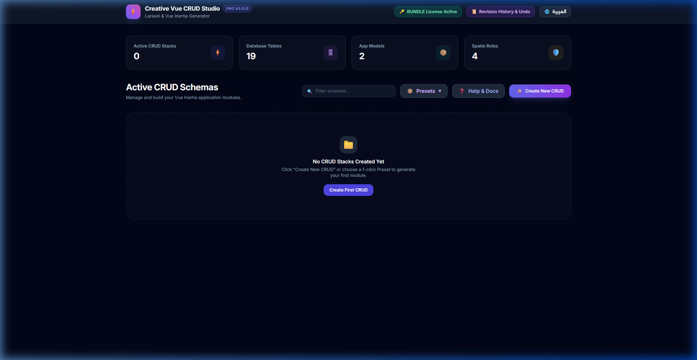
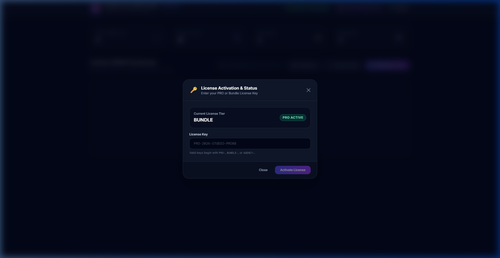
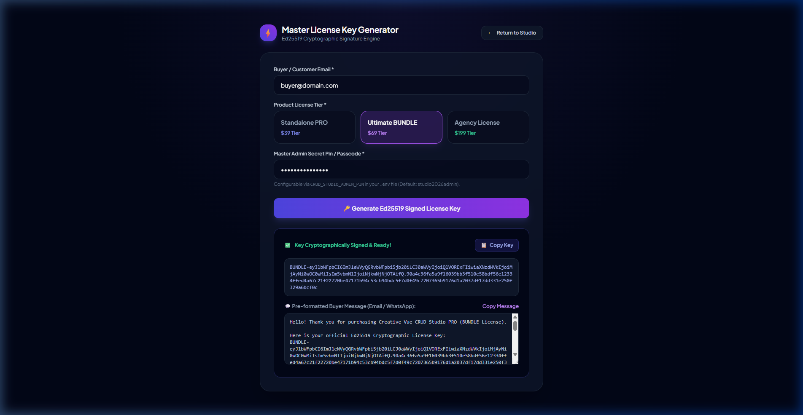
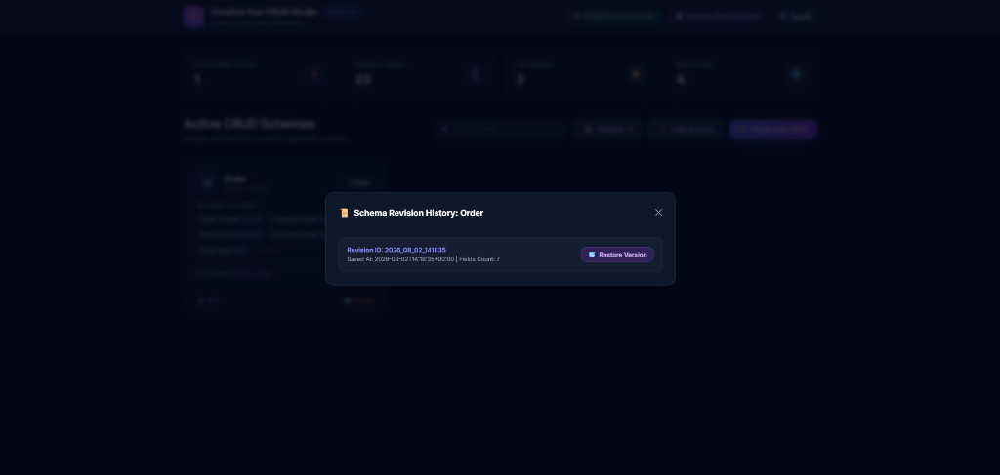
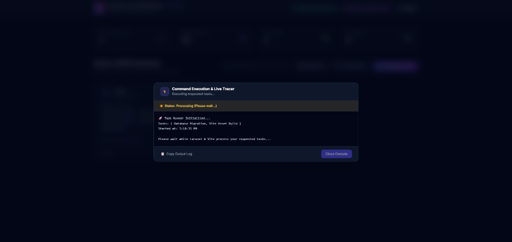
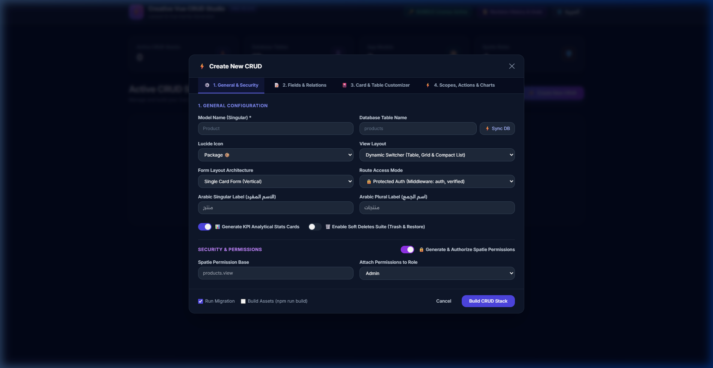
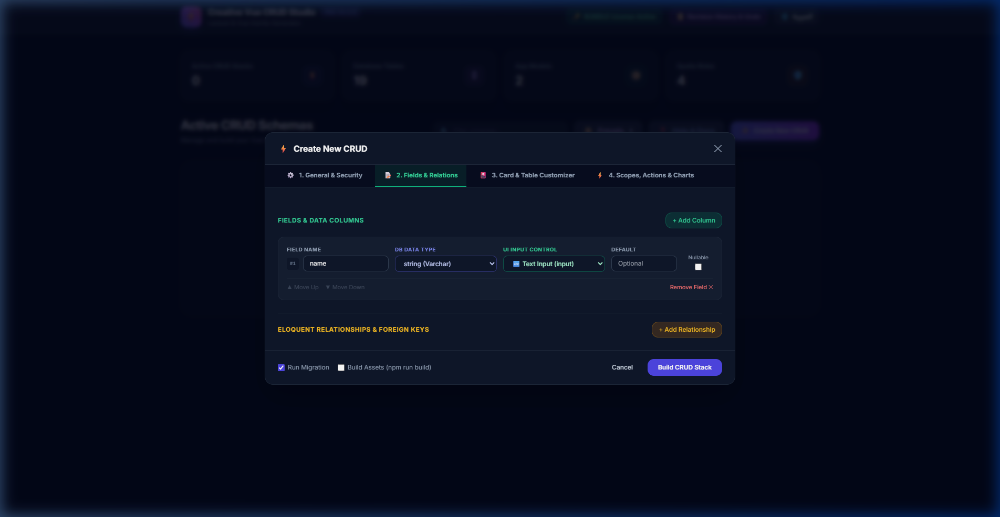
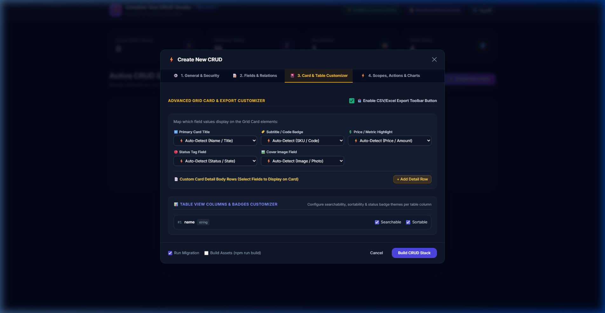
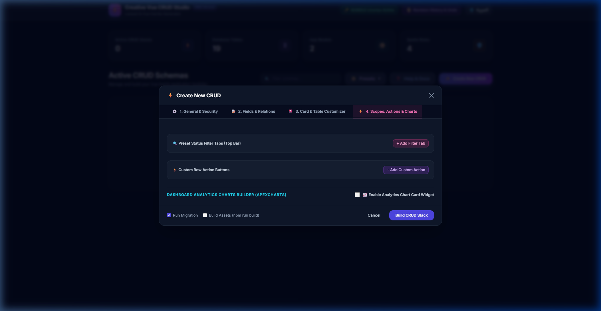

<div align="center">
  

  # 🚀 Laravel Vue Creative Dashboard Bundle (PRO)
  ### State-of-the-Art Enterprise SaaS Dashboard & Integrated Visual CRUD Studio Suite
  *Crafted with Laravel 13, Vue 3 (Composition API), Inertia v3, Tailwind CSS v4, TypeScript, Spatie RBAC & Creative Vue CRUD Studio v5.0 PRO*

  <br />

  [](https://laravel.com)
  [](https://vuejs.org)
  [](https://inertiajs.com)
  [](https://tailwindcss.com)
  [](https://www.typescriptlang.org)
  [](https://github.com/mr-creative-hmh/creative-vue-crud-studio-)
  [](LICENSE.md)

</div>

---

## 🌟 Overview & Turnkey SaaS Solution

The **Laravel Vue Creative Dashboard Bundle (PRO)** is an all-in-one, enterprise-grade SaaS foundation and visual code generation suite. It combines the production-ready **Creative Starter Dashboard Kit** with the powerful **Creative Vue CRUD Studio (v5.0 PRO Engine)** pre-installed and seamlessly integrated.

Engineered for rapid development, it delivers a bi-directional (**English & Arabic RTL**) web application with complete **Spatie RBAC**, real-time audit trails with **1-click undo**, user impersonation, Passkeys/2FA authentication, and a visual 4-Tab Web Studio Dashboard (`/crud-studio`) + CLI generator that outputs production-ready Eloquent Models, Migrations, Controllers, Form Requests, API Resources, and Vue 3 Inertia pages in **30 seconds**.

> **Author:** Eng. Hasan Mohammad Hasan (م. حسن محمد حسن)

---

## 🖼️ Visual Showcase & Comprehensive Screenshots

### 💻 Enterprise LTR Dashboard Overview


### 🌐 Native Bi-Directional Arabic (RTL) Dashboard


### 👥 User Management & User Impersonation


### 👑 Spatie Roles & Granular Permissions Matrix


### 📜 Real-Time Audit Trails & 1-Click State Reversal


---

### 🎛️ Creative Vue CRUD Studio PRO Showcase

#### 💻 Main Studio Dashboard Overview (`/crud-studio`)


#### 🔑 License Activation & Status Management Modal


#### 👑 Master License Key Generator Web UI (Creator Access)


#### 📜 Schema Revision History & 1-Click Rollback Engine


#### 🚀 Live Command Execution & Task Tracer Console


#### ⚙️ Studio Modal — Tab 1: General Configuration & Security


#### 📝 Studio Modal — Tab 2: Fields & Eloquent Relationships Builder


#### 🎴 Studio Modal — Tab 3: Grid Card Mapper & Table Column Customizer


#### ⚡ Studio Modal — Tab 4: Filter Scopes, Row Actions & ApexCharts Widget Builder


---

## ✨ Enterprise Feature Matrix

### 🛡️ Core Dashboard Foundation Features

| Module | Feature Capabilities |
| :--- | :--- |
| **Authentication & Security** | Laravel Fortify backend, Passkeys (WebAuthn), Two-Factor Authentication (2FA) with QR & recovery codes, session management, and rate limiting. |
| **User Impersonation** | 1-Click "Log in as User" capability for Super Admins with sticky status banner and full audit log tracking. |
| **RBAC & Authorization** | Spatie Roles & Permissions with granular permission matrices, custom module generators, and reactive `useAuth()` composable. |
| **Audit Trails & 1-Click Undo** | Complete activity logging with JSON diff visualizer and 1-click state reversal for created/updated models. |
| **System Settings** | Control application name, support email, default language, and web-wide **Maintenance Mode** directly from the UI. |
| **API Access Tokens** | Issue, manage, and revoke Laravel Sanctum personal access tokens with custom permissions. |
| **Notification Center** | Real-time unread badge counter, slide-out notification drawer, and full management page. |
| **Data Tables & Batch Actions** | Multi-select checkboxes, batch operations (bulk delete, status toggling), server-side pagination, sorting, and search filters. |
| **i18n & Bi-directional RTL** | Instant switching between **English (LTR)** and **Arabic (RTL)** with layout direction synchronization. |
| **Theme & Color Accents** | Light/Dark theme switching with customizable primary color swatch accents (Indigo, Emerald, Violet, Rose, Amber, Slate). |

---

### ⚡ Creative Vue CRUD Studio (v5.0 PRO Engine Features)

| Feature | Description |
| :--- | :--- |
| **🎛️ 4-Tab Visual Studio** | Zero-clutter 4-tab modal interface: `⚙️ General & Security`, `📝 Fields & Relations`, `🎴 Card & Table Customizer`, `⚡ Scopes, Actions & Charts`. |
| **📜 Schema Revision Engine** | Automated timestamped schema snapshots stored under `.crud-studio/schemas/history/` with 1-click revision rollback. |
| **📱 Context-Aware Smart Controls** | Auto-maps column types to WYSIWYG Editors, Color Pickers, Currency Inputs, iOS Toggle Switches, Date/Time Pickers, and File Uploads. |
| **🎴 Advanced Grid Card Mapper** | Custom card layout builder with Primary Title, Subtitle, Metric, Status, Cover Image, and detail body row mappers. |
| **📊 Dynamic View Switcher** | Generates views supporting **Data Table**, **Media Grid Cards**, and **Compact List** layouts out of the box. |
| **📥 Streaming CSV Export** | Memory-efficient streaming CSV export endpoint (`/{prefix}/export`). |
| **📈 ApexCharts Widget Builder** | Visual chart generator outputting real-time `Bar`, `Line`, `Donut`, and `Area` analytical widgets. |
| **🗑️ Soft Deletes Suite** | Complete trash, restore, and permanent deletion support across Migrations, Models, Controllers, and Vue pages. |
| **📦 11 Domain Presets** | 1-Click presets for Products, Orders, Blog Posts, Support Tickets, Patients, Courses, Restaurant Menu, Categories, Projects, CRM Customers, Coupons. |
| **🛡️ Auto-Detection Engine** | `EnvironmentInspector` auto-detects Spatie Permissions, Spatie ActivityLog, Maatwebsite Excel, and App Layout containers cleanly. |

---

## 🛠️ Technology Stack & Dependencies

```
laravel-vue-creative-dashboard-bundle/
├── Backend Framework     : Laravel 13.x (PHP 8.3+)
├── Frontend Framework    : Vue 3.x (Composition API, <script setup>)
├── SPA Bridge            : Inertia.js v3.0
├── CSS & Design System   : Tailwind CSS v4.0 + Radix Vue / shadcn-vue
├── Language & Typing     : TypeScript 5.x + Vue-TSC
├── CRUD Studio Generator : Creative Vue CRUD Studio v5.0 PRO
├── Security & Auth       : Laravel Fortify, Sanctum, WebAuthn Passkeys
├── Roles & Permissions   : Spatie Laravel-Permission v8.x
├── Audit Trails          : Spatie Laravel-Activitylog v4.x
├── Analytics & Charts    : ApexCharts + Vue3-ApexCharts
├── Toast Alerts          : Vue-Sonner
└── Testing Suite         : Pest PHP 4.x (73 Passed Tests)
```

---

## 🚀 Quick Start & Installation Guide

### Prerequisites
- **PHP** >= 8.3
- **Composer** >= 2.x
- **Node.js** >= 20.x & **NPM**

### Step-by-Step Installation

```bash
# 1. Clone the repository
git clone https://github.com/mr-creative-hmh/laravel-vue-creative-dashboard-bundle.git
cd laravel-vue-creative-dashboard-bundle

# 2. Install PHP Dependencies
composer install

# 3. Install Node.js Frontend Dependencies
npm install

# 4. Environment Setup
cp .env.example .env
php artisan key:generate

# 5. Storage Symlink
php artisan storage:link

# 6. Database Migrations & Initial Seeding
php artisan migrate:fresh --seed

# 7. Publish Creative Vue CRUD Studio Assets & Config
php artisan crud-studio:install

# 8. Start Local Development Servers (Artisan + Vite)
composer run dev
```

The application will be accessible at **`http://localhost:8000`** in your browser.

---

## 🔑 Pre-Configured Test Accounts

After database seeding (`php artisan migrate:fresh --seed`), test accounts with varying permission levels are available:

| Role | Email | Password | Access Level |
| :--- | :--- | :--- | :--- |
| **Super Admin** | `admin@example.com` | `password` | Unrestricted System Access |
| **Admin** | `manager.admin@example.com` | `password` | User & System Management |
| **Manager** | `manager@example.com` | `password` | Users & Audit Trail Reversals |
| **User** | `user@example.com` | `password` | Standard Dashboard End-User |

---

## 🧰 Artisan Commands Reference

```bash
# Launch Interactive CLI CRUD Studio Generator
php artisan crud-studio:make

# Display CRUD Studio Help Guide
php artisan crud-studio:help

# Re-publish CRUD Studio Assets & Configuration
php artisan crud-studio:install

# Activate PRO License Key via CLI
php artisan crud-studio:license PRO-2026-STUDIO-PRO88

# Generate CRUD Permissions for a Specific Model (e.g., Product)
php artisan permissions:generate Product

# Automatically Scan app/Models/ and Sync Missing Permissions
php artisan permissions:sync
```

---

## 💎 Product Tiers & Licensing

| Tier | License Key Format | Target Audience | Highlights |
| :--- | :--- | :--- | :--- |
| **Free Community** | None | Open-Source Developers | Basic CRUD generation & Free Starter Kit. |
| **PRO License ($39)** | `PRO-XXXX-XXXX-XXXX` | Single Developer | Full PRO Studio, Revision Engine, ApexCharts & Smart Controls. |
| **PRO Bundle ($69)** | `BUNDLE-XXXX-XXXX-XXXX` | Turn-Key Buyers | Starter Kit + CRUD Studio PRO pre-installed & pre-activated. |
| **Agency License ($199)** | `AGENCY-XXXX-XXXX-XXXX` | Dev Teams & Agencies | Unlimited client projects & Whitelabel rights. |

---

## 🧪 Code Quality & Automated Tests

```bash
# Run Pest PHP Test Suite (73 passing tests)
php artisan test

# Check Code Formatting (Laravel Pint)
vendor/bin/pint --test

# Automatically Fix Code Formatting
vendor/bin/pint

# Run Vue/TypeScript Type Checker
npm run types:check

# Compile Production Frontend Assets
npm run build
```

---

## 📄 License & Commercial Agreement

This project is released under dual **MIT & Commercial License** terms.

Designed and developed with ❤️ by **Eng. Hasan Mohammad Hasan** (م. حسن محمد حسن).
